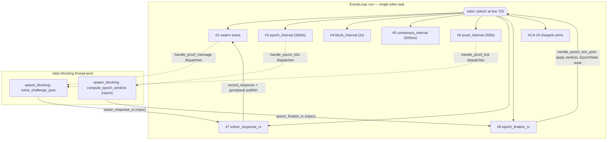

# Event Loop Topology

`src/node/src/event_loop.rs` is the heart of every Commputer node. A single
`tokio::select!` macro inside `EventLoop::run` (line 702) multiplexes 18
async sources onto one task. **The select! itself is single-threaded:** while
any arm body is executing, no other arm can fire. This document is the map
that lets you reason about that constraint without re-reading 3,500 lines.

> **If you only read one section, read [Invariants](#invariants).**

---

## 1. Arm inventory

All line numbers reference `src/node/src/event_loop.rs` at commit `bbbed4f`
(2026-05-04). The select! starts at **line 702** and ends at **line 927**.

| # | Arm pattern | Trigger | Cadence | Body work | Start line |
|---|---|---|---|---|---|
| 1 | `swarm_result = ... swarm.select_next_some() ...` | libp2p swarm event stream | Burst (per packet / connection event) | `protocol-state-update` (synchronous gossip handling — and in `handle_proof_message` it transitively `cpu-dispatch`es PoW) | 703 |
| 2 | `Some(tx) = rpc_recv` | `mpsc::Receiver<Transaction>` from RPC server | On every RPC submit | `cheap` (mempool insert + signature cache) | 718 |
| 3 | `_ = epoch_interval.tick()` | `time::interval(3600s)` | Every 3600s (hourly) | `cpu-dispatch` (post bbbed4f); previously `cpu-inline` (~110s stalls) | 722 |
| 4 | `_ = block_interval.tick()` | `time::interval(2s)` | Every 2s | `protocol-state-update` (block production / propose) | 726 |
| 5 | `_ = consensus_interval.tick()` | `time::interval(500ms)` | Every 500ms | `protocol-state-update` (Snowball query rounds) | 730 |
| 6 | `_ = proof_interval.tick()` | `time::interval(300s)` | Every 300s | `cpu-dispatch` (post 2227d1d/82551ad) | 733 |
| 7 | `Some(response) = self.solver_response_rx.recv()` | mpsc from `spawn_blocking` solver workers | Once per challenge solved | `cheap` (record + publish) | 736 |
| 8 | `Some(epoch_data) = self.epoch_finalize_rx.recv()` | mpsc from `spawn_blocking` verdict worker | Once per epoch boundary | `protocol-state-update` (verdict apply, EpochState reset, account scan) | 742 |
| 9 | `_ = peer_exchange_interval.tick()` | `time::interval(60s)` | Every 60s | `io` (gossipsub publish) | 750 |
| 10 | `_ = ping_interval.tick()` | `time::interval(30s)` | Every 30s | `io` (libp2p ping send) | 753 |
| 11 | `_ = partition_check_interval.tick()` | `time::interval(10s)` | Every 10s | `cheap` (peer-count threshold) | 756 |
| 12 | `_ = seed_reconnect_interval.tick()` | `time::interval(30s)` | Every 30s | `io` (libp2p dial) | 759 |
| 13 | `_ = sync_timer.tick()` | `time::interval(5s)` | Every 5s | `protocol-state-update` (sync state machine drive) | 762 |
| 14 | `_ = peer_rotation_interval.tick()` | `time::interval(300s)` | Every 300s | `cheap` (peer score sort + drop) | 873 |
| 15 | `_ = job_timeout_interval.tick()` | `time::interval(30s)` | Every 30s | `cheap` (HashMap scan over jobs) | 876 |
| 16 | `_ = status_line_interval.tick()` | `time::interval(60s)` | Every 60s | `cheap` (one log line) | 888 |
| 17 | `_ = async { sighup.recv() ... }` | `tokio::signal::unix::signal(SIGHUP)` | Operator-driven | `io` (config reload from disk) | 901 |
| 18 | `_ = tokio::signal::ctrl_c()` | SIGINT | Operator-driven | `protocol-state-update` (graceful shutdown — flush state, persist mempool, return) | 911 |
| 19 | `_ = async { sigterm.recv() ... }` | `tokio::signal::unix::signal(SIGTERM)` | Operator-driven | `protocol-state-update` (same shutdown path as ctrl_c) | 916 |

**Total: 19 arms** (the inventory came in at 19, not the "~10+" estimate in
the task brief — yet another reason this map was overdue).

### Body-work classification key

- **cheap** — pure synchronous work expected to complete in well under 10ms.
  HashMap inserts, log lines, simple state mutation.
- **io** — async I/O against the libp2p swarm or filesystem. Bounded by
  network and disk; not CPU-bound, but can stall the select if the future
  itself doesn't yield.
- **cpu-dispatch** — the arm body itself is cheap; the heavy work is sent
  to `tokio::task::spawn_blocking` and the result returns via mpsc into a
  separate arm. **This is the correct pattern.** See section 2.
- **cpu-inline** — *DANGER*. The arm body runs CPU-bound work synchronously
  and blocks every other arm of the same select! for the duration. As of
  commit `bbbed4f` no arm should be in this category. If you are about to
  add one, stop and read section 5.
- **protocol-state-update** — synchronous chain-state mutation. Should
  remain bounded (block apply, consensus tick, sync FSM). Anything that
  starts taking >10ms here is a candidate for the cpu-dispatch pattern.

---

## 2. Channel-based offload patterns

There are **two** spawn_blocking → mpsc → new-arm trios in event_loop.rs
today. They share the same shape; document them together so the next person
adding one starts from a known template.

### 2.1 Proof-solver offload

| Field | Value |
|---|---|
| Origin handlers | `handle_proof_tick` (line 3139) **and** `handle_proof_message` (line 3178, called from inside `handle_swarm_event` at line 1221) |
| What gets dispatched | `ProofManager::solve_challenge_pure(&challenge, &storage_data, our_address)` — Argon2/Blake3-style proof-of-work that can take seconds |
| Sender field | `solver_response_tx: mpsc::UnboundedSender<ProofResponse>` (line 123) |
| Receiver field | `solver_response_rx: mpsc::UnboundedReceiver<ProofResponse>` (line 126) |
| Apply-side handler | The arm body at line 736 itself — it calls `self.proof_manager.record_response(...)` then publishes `ProofMessage::Response` over gossipsub |
| Why moved off-task | Empirical: at startup, the very first proof tick triggered a multi-second PoW solve in the arm body. While it ran, the libp2p swarm arm (#1) couldn't fire, so peers handshaking against us appeared to hang. Symptom: "peer connection takes 30s+ at startup." |
| Canonical commits | `a7db3d8` (extract `solve_challenge_pure`), `a95e2f4` (add channel), `82551ad` (use spawn_blocking in handle_proof_tick), `b454744` (use spawn_blocking in handle_proof_message), `2227d1d` (wire the receiver arm) |

Both origin handlers spawn the PoW into `tokio::task::spawn_blocking` with a
clone of `solver_response_tx`; the worker is fire-and-forget; the arm at
line 736 is the only consumer.

### 2.2 Epoch-finalize offload

| Field | Value |
|---|---|
| Origin handler | `handle_epoch_tick` (line 2331), called from arm #3 |
| What gets dispatched | `ProofManager::compute_epoch_verdicts(&pending, &responses, &expired, height)` — a rayon-parallel verifier loop over every outstanding challenge for the epoch |
| Sender field | `epoch_finalize_tx: mpsc::UnboundedSender<EpochFinalizeData>` (line 130) |
| Receiver field | `epoch_finalize_rx: mpsc::UnboundedReceiver<EpochFinalizeData>` (line 132) |
| Apply-side handler | `handle_epoch_tick_post` (line 2392), called from arm #8 — runs `finalize_epoch_with_precomputed_verdicts`, records summaries into `EpochState`, resets, and feeds the chain forward |
| Why moved off-task | Stress runs of 2026-05-04 with 3 validators showed the chain stalled for **~110 seconds** at every epoch transition. The verifier loop ran inline in arm #3, and the block_interval (#4), consensus (#5), and swarm (#1) arms could not fire. Block production and consensus literally paused for the duration. |
| Canonical commits | `5aafa22` (split `finalize_epoch` into pure verdict + apply phases), `5010d5f` (parallelize via rayon), `f9a125f` (wire to parallel path), `d764931` (failed `block_in_place` attempt — see 5.3), `bbbed4f` (real fix: spawn_blocking + mpsc channel) |

`EpochFinalizeData` (defined at line 99) carries the verdicts plus a
sanity-check epoch number and validator count, so the apply side can refuse
to apply stale verdicts if anything went sideways.

---

## 3. What blocks what

Rows = arms whose body could conceivably run long. Columns = arms whose
firing is delayed by however long the row's body runs. The same column
labels apply to every row; rows and columns share the inventory numbers.

| Slow arm (row) → blocks → | #1 swarm | #4 block | #5 consensus | #7 solver_rx | #8 epoch_rx | #13 sync | other tickers (#9,10,11,12,14,15,16) |
|---|---|---|---|---|---|---|---|
| **#1 swarm** (handle_swarm_event — long if it transitively does inline CPU work) | — | X | X | X | X | X | X |
| **#3 epoch tick** (post bbbed4f: cpu-dispatch ≈ cheap; **pre-fix it was ~110s of cpu-inline blocking everything**) | X | X | X | X | X | X | X |
| **#4 block tick** (block production / apply) | X | — | X | X | X | X | X |
| **#5 consensus tick** (Snowball query) | X | X | — | X | X | X | X |
| **#6 proof tick** (post 2227d1d: cpu-dispatch) | X | X | X | X | X | X | X |
| **#8 epoch_finalize_rx** (apply side) | X | X | X | X | — | X | X |
| **#13 sync_timer** (large state machine body) | X | X | X | X | X | — | X |
| **All other arms** (cheap / io with internal yields) | ✓ | ✓ | ✓ | ✓ | ✓ | ✓ | ✓ |

**Reading rule:** every arm blocks every other arm for the duration of its
body, because that's how `tokio::select!` works. The table above is really
a forecast of *which arms have bodies long enough that you'll notice.* Move
those bodies off-task with the channel pattern in section 2.

The "✓" row at the bottom is not "this arm cannot block others" — *every*
arm blocks the others while it runs. It means: these arms' bodies are short
enough that the blocking is invisible at human timescales.

---

## 4. Diagram



```mermaid
sequenceDiagram
    autonumber
    participant Tick as epoch_interval
    participant Loop as select! task
    participant Pool as spawn_blocking pool
    participant Apply as epoch_finalize_rx arm

    Tick->>Loop: tick fires (arm #3)
    Loop->>Loop: handle_epoch_tick — cheap setup, transition log
    Loop->>Pool: spawn_blocking(compute_epoch_verdicts)
    Note over Loop: arm #3 body returns immediately;<br/>select! free to fire #1, #4, #5, etc.
    Pool-->>Apply: epoch_finalize_tx.send(EpochFinalizeData)
    Apply->>Loop: arm #8 fires
    Loop->>Loop: handle_epoch_tick_post — apply verdicts, reset
```

---

## 5. Troubleshooting playbook

### 5.1 Symptom: "Block production stalls during epoch transition"

- **Diagnosis.** The chain stops producing blocks every ~3600 seconds,
  resumes after a long pause. Logs probably show
  `--- Epoch N Transition (bookkeeping) ---` immediately followed by silence
  on the block_interval. This is the exact failure mode that motivated
  commit `bbbed4f`.
- **Likely cause.** Someone re-introduced inline CPU work into
  `handle_epoch_tick` (or one of the functions it transitively calls before
  the spawn_blocking dispatch at line 2372).
- **Fix pattern.** Restore the `spawn_blocking` + `epoch_finalize_tx` +
  arm #8 dispatch. Confirm the work happens in `compute_epoch_verdicts`
  and not in the arm body. See commit `bbbed4f` for the canonical shape.

### 5.2 Symptom: "Peer connection takes 30s+ at startup"

- **Diagnosis.** New peers connect at the libp2p layer but appear to hang
  during identify / gossipsub handshake. Logs show
  `Proof challenges issued and solved for epoch ...` *after* the long
  pause, not before.
- **Likely cause.** Inline PoW solving in `handle_proof_tick` or
  `handle_proof_message`. While the solver runs in the arm body, the
  swarm arm (#1) cannot fire, so libp2p protocol negotiation can't make
  progress.
- **Fix pattern.** Send the `solve_challenge_pure(...)` call to
  `spawn_blocking` and consume the result on arm #7. See commits `82551ad`
  and `b454744` for the two canonical sites.

### 5.3 Symptom: "I wrapped the slow body in `block_in_place` and nothing got better"

> **CRITICAL — this is the failure that motivated this whole document.**
>
> `tokio::task::block_in_place` does **not** make a `select!` arm
> non-blocking. block_in_place tells the multi-thread runtime "this task
> is going to block, please move other tasks off this worker," but a
> `select!` arm body is *part of the calling task*, not a separate task.
> The select itself cannot fire any other arm until the body returns.
>
> The empirical commit log:
> - `d764931` — wrapped `handle_epoch_tick` in `block_in_place`. Stress
>   run still showed ~110s stalls. Wrong tool.
> - `bbbed4f` — replaced with `spawn_blocking` + mpsc channel + new arm.
>   Stalls eliminated.

- **Diagnosis.** You see `tokio::task::block_in_place(|| heavy_work())`
  inside an arm body, and the stalls persist.
- **Fix pattern.** This is the fix every time:
  1. Extract the heavy work into a pure function (no `&mut self`).
  2. Add an `mpsc::UnboundedChannel` field pair to `EventLoop`
     (`*_tx`, `*_rx`).
  3. In the origin arm body, gather the inputs, clone the sender,
     and `tokio::task::spawn_blocking(move || { let result = heavy(...);
     let _ = tx.send(result); });`. The arm body returns immediately.
  4. Add a new `select!` arm: `Some(result) = self.X_rx.recv() => { ... }`
     that performs the apply phase on the event-loop task.
  5. Run a multi-validator stress test before declaring it fixed.
- **Canonical references.** `bbbed4f` for the epoch path, `2227d1d` +
  `b454744` for the proof-solver path. Both predate this doc; both
  followed exactly the recipe above.

### 5.4 Symptom: "Consensus rounds drift / Snowball never converges"

- **Diagnosis.** `consensus_interval` (#5) ticks every 500ms; if any other
  arm's body exceeds ~500ms regularly, queries fall behind and the
  finality timer keeps re-sending instead of progressing.
- **Likely cause.** A new arm body added without the cpu-dispatch pattern,
  or a regression in arm #1, #4, #8, or #13.
- **Fix pattern.** Profile the offending body. If it's CPU-bound, apply
  section 5.3. If it's I/O-bound and not yielding, audit for
  `std::sync::Mutex` (use `tokio::sync::Mutex` or refactor) or for
  blocking filesystem calls (move them to `tokio::task::spawn_blocking`
  or `tokio::fs`).

### 5.5 Symptom: "Channel arm never fires"

- **Diagnosis.** You added a `*_tx`/`*_rx` pair and a new arm, but the
  arm body never runs.
- **Likely causes (in order of frequency).**
  1. The sender was dropped before sending — the `let _ = tx.send(...)`
     was unreachable (panic in the worker, early return).
  2. The `*_tx` field is owned but never cloned into the spawned worker.
     Without a clone the worker has no handle.
  3. The receiver is the *only* receiver but has been moved or replaced
     elsewhere (`mpsc::UnboundedReceiver` is not `Clone`; only
     `Sender` is).
- **Fix pattern.** Add a `tracing::debug!` immediately before
  `tx.send(...)` in the worker and immediately in the arm body. Run.
  See which logs appear.

---

## 6. Invariants

These are the rules that must hold for the select! to behave. Violating
any of them re-introduces the kind of bug `bbbed4f` fixed.

1. **No arm body may exceed ~10ms of synchronous CPU work.** Anything
   heavier MUST go through `spawn_blocking` + an mpsc channel + a new
   arm. There is no exception. `block_in_place` does not satisfy this
   invariant — see 5.3.
2. **No arm body may call a blocking syscall directly.** Filesystem,
   `std::thread::sleep`, blocking sockets — all forbidden. Use the
   `tokio::fs` analog or `spawn_blocking`.
3. **No arm body may hold a `std::sync::Mutex` across `.await`.** Either
   drop the guard before awaiting, or use `tokio::sync::Mutex`. (The
   compiler enforces this for `MutexGuard`'s `!Send`-ness; the rule is
   here for completeness.)
4. **Every spawn_blocking worker MUST send exactly one message back per
   dispatch.** Forgetting to send leaves the receiver arm waiting
   forever. Sending more than once is fine (UnboundedReceiver buffers),
   but log it.
5. **Every channel-offload arm body must be `cheap` itself.** Don't
   move heavy work off-task only to do equally-heavy *apply* work in
   the receive arm. If `handle_X_tick_post` itself becomes slow, split
   *it* off the same way.
6. **The select! is single-threaded; act like it.** When you add an
   arm, walk the inventory in section 1 and ask: "could this body, in
   the worst case, delay #4 (block production)?" If yes, redesign.
7. **`event_loop.rs` is a protected file.** Agents must propose changes
   here as new files in `src/staging/`; only the founder edits the
   real file. This document is part of that protection: read it first.
8. **Update this document when you touch the select!.** Add or remove
   an arm? Add a row to section 1. Add a new channel-offload trio?
   Add an entry to section 2. Any of those changes silently break the
   mental model the next maintainer (human or agent) is using.

---

## Appendix: file references

- Select macro: `src/node/src/event_loop.rs:702`
- Select close: `src/node/src/event_loop.rs:927`
- `EpochFinalizeData` struct: `src/node/src/event_loop.rs:99`
- `solver_response_tx`/`_rx` fields: `src/node/src/event_loop.rs:123`–`126`
- `epoch_finalize_tx`/`_rx` fields: `src/node/src/event_loop.rs:130`–`132`
- `handle_proof_tick` (dispatch): `src/node/src/event_loop.rs:3139`
- `handle_proof_message` (dispatch): `src/node/src/event_loop.rs:3178`
- `handle_epoch_tick` (dispatch): `src/node/src/event_loop.rs:2331`
- `handle_epoch_tick_post` (apply): `src/node/src/event_loop.rs:2392`
- Interval declarations: `src/node/src/event_loop.rs:648`–`678`
- Pure verdict computation: `src/node/src/proof_manager.rs::compute_epoch_verdicts`
- Pure proof solve: `src/node/src/proof_manager.rs::solve_challenge_pure`
